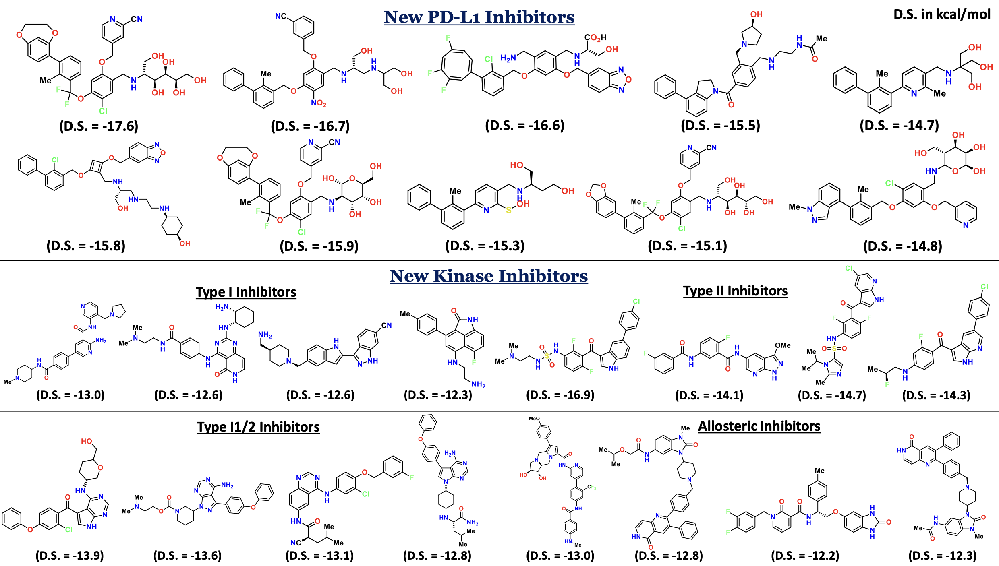

# VECTOR+: Valid Property-Enhanced Contrastive Learning for Targeted Optimization & Resampling for Novel Drug Design


This repository contains the official implementation for the paper: "VECTOR+: Valid Property-Enhanced Contrastive Learning for Targeted Molecular Generation"

**Authors:** Amartya Banerjee, Somnath Kar, Anirban Pal, Debabrata Maiti


## Description

Efficiently steering generative models toward pharmacologically relevant regions of chemical space is a major challenge in drug discovery under low-data regimes. We present **VECTOR+** (Valid-property-Enhanced Contrastive Learning for Targeted Optimization and Resampling), a framework that combines property-guided representation learning with controllable molecule generation. VECTOR+ enables interpretable, data-efficient exploration of functional chemical space, providing a principled approach for AI-driven drug design.




## Installation

### Requirements
- Python 3.9+
- CUDA-capable GPU (recommended)
- 8GB+ GPU memory for training

### Environment Setup

```bash
# Clone repository
git clone https://github.com/amartya21/vector-drug-design.git
cd vector-drug-design

# Create conda environment
conda create -n vector-plus python=3.12
conda activate vector-plus

# Install PyTorch (adjust CUDA version as needed)
conda install pytorch torchvision torchaudio pytorch-cuda=11.8 -c pytorch -c nvidia

# Install dependencies
pip install transformers scikit-learn pandas numpy scipy matplotlib seaborn umap-learn tqdm rdkit-pypi
```

## Data Preparation

### Dataset Format

Input files should be CSV or Excel format with the following columns:
- `SMILES`: Molecular structure representation (required)
- Activity column: `IC50_log` for regression or `Class` for classification

### Included Datasets

1. **PD-L1 Inhibitors**: IC50-based activity prediction
2. **Kinase Inhibitors**: Four binding mode classes

## Training

### Full Pipeline Training

**Example run with custom configs**: Training all components (contrastive encoder, decoder, and GMM) 


For the PD-L1 dataset:

```bash
python main.py \
    --dataset ic50 \
    --data_path Data/IC50_log_transformed_combine.csv \
    --models_dir models \
    --results_dir results \
    --num_bins 2 \
    --ic50_column IC50_log \
    --seed 0 \
    --contrastive_epochs 1000 \
    --decoder_epochs 1000 \
    --batch_size 512 \
    --learning_rate 5e-5 \
    --embed_dim 128 \
    --hidden_dim 512 \
    --n_layers 3 \
    --dropout 0.2 \
    --train_contrastive \
    --train_decoder \
    --fit_gmm \
    --device cuda
```

For the kinase dataset:

```bash
python main.py \
    --dataset kinase \
    --data_path Data/Kinase_inhibitors.xlsx \
    --models_dir models \
    --results_dir results \
    --seed 0 \
    --contrastive_epochs 1000 \
    --decoder_epochs 1000 \
    --batch_size 512 \
    --learning_rate 5e-5 \
    --train_contrastive \
    --train_decoder \
    --fit_gmm \
    --device cuda
```

### Component-wise Training

Train individual components as needed:

```bash
# Train only contrastive encoder
python main.py \
    --dataset ic50 \
    --data_path Data/IC50_log_transformed_combine.csv \
    --train_contrastive \
    --contrastive_epochs 1000

# Train only decoder (requires trained contrastive model)
python main.py \
    --dataset ic50 \
    --data_path Data/IC50_log_transformed_combine.csv \
    --train_decoder \
    --decoder_epochs 1000

# Fit only GMM (requires trained contrastive model)
python main.py \
    --dataset ic50 \
    --data_path Data/IC50_log_transformed_combine.csv \
    --fit_gmm
```

## Generation

### Generate Molecules Using Trained Models

Generate molecules with unconditional sampling:

```bash
python main.py \
    --dataset ic50 \
    --data_path Data/IC50_log_transformed_combine.csv \
    --models_dir models \
    --results_dir results \
    --n_generate 2500 \
    --max_attempts 2500 \
    --temperature 1.0 \
    --sampling_mode unconditional \
    --generate \
    --skip_umap
```

Generate molecules with hill-climbing (e.g., Lipinski's Rule):

```bash
python main.py \
    --dataset ic50 \
    --data_path Data/IC50_log_transformed_combine.csv \
    --models_dir models \
    --results_dir results \
    --n_generate 2500 \
    --max_attempts 2500 \
    --temperature 1.0 \
    --sampling_mode hill_climbing \
    --k 15 \
    --top_p 0.2 \
    --alpha_noise 0.2 \
    --generate \
    --skip_umap
```

### Combined Training and Generation

Complete pipeline from training to generation:

```bash
python main.py \
    --dataset ic50 \
    --data_path Data/IC50_log_transformed_combine.csv \
    --models_dir models \
    --results_dir results \
    --num_bins 2 \
    --contrastive_epochs 1000 \
    --decoder_epochs 1000 \
    --n_generate 2500 \
    --train_contrastive \
    --train_decoder \
    --fit_gmm \
    --generate
```

## Output Structure

```
results/
├── ic50/
│   └── generated_smiles.pkl    # Generated molecules dictionary
└── kinase/
    └── generated_smiles.pkl    # Generated molecules by class

models/
├── ic50/
│   ├── contrastive/
│   │   ├── contrastive_model.pt
│   │   └── tokenizer/
│   ├── decoder.pt
│   ├── gmm.pkl
│   └── vocab/
│       ├── char2idx.pkl
│       └── idx2char.pkl
└── kinase/
│   ├── contrastive/
│   │   ├── contrastive_model.pt
│   │   └── tokenizer/
│   ├── decoder.pt
│   ├── gmm.pkl
│   └── vocab/
│       ├── char2idx.pkl
│       └── idx2char.pkl
```


## Citation

Coming Soon

## License

This project is licensed under the MIT License - see the [LICENSE](LICENSE) file for details.